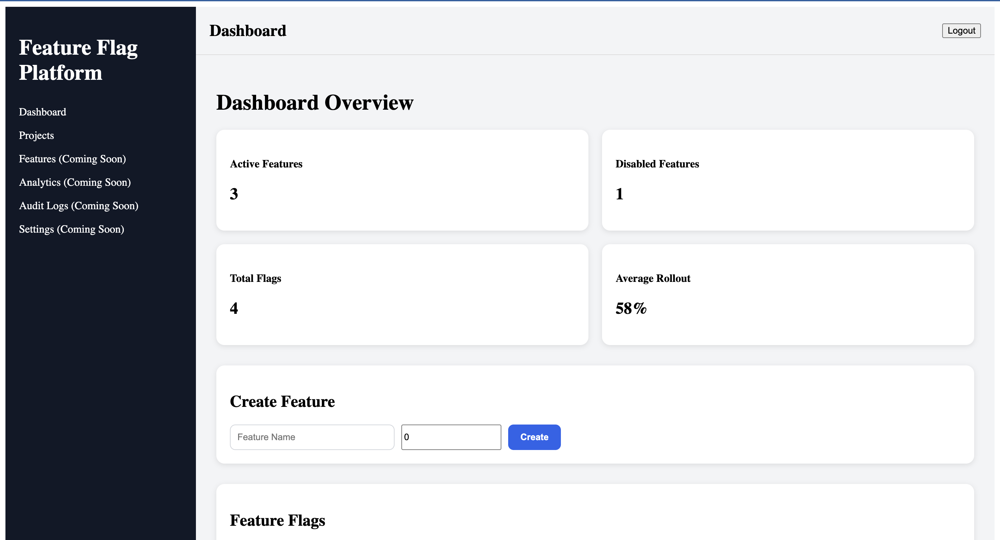
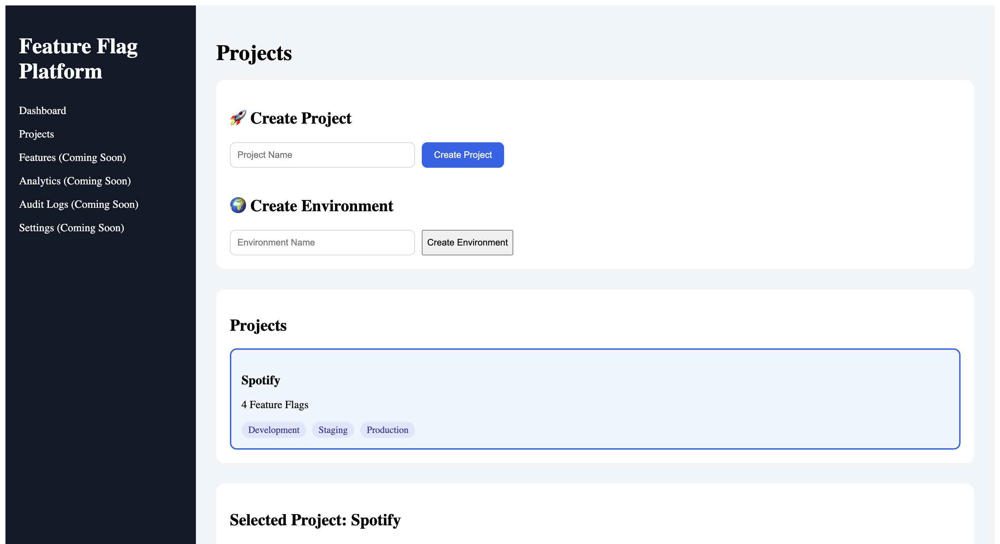
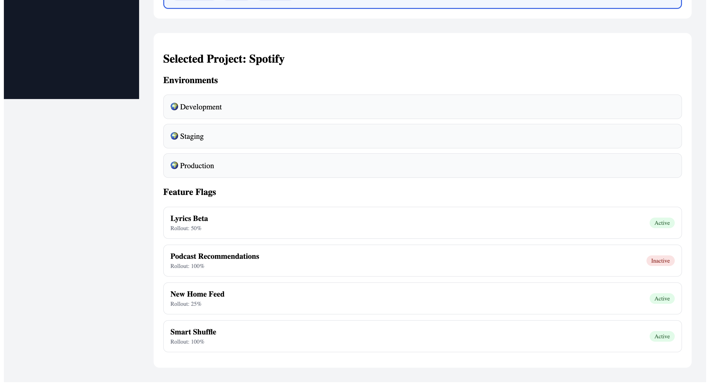
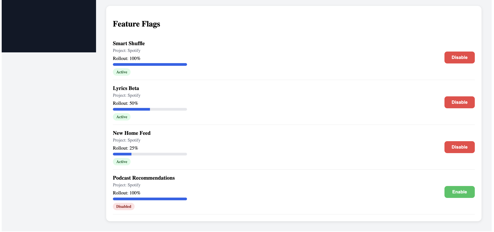

# Feature Flag Platform

A full-stack feature flag management platform inspired by LaunchDarkly. This application allows teams to create projects, manage feature flags, configure rollout percentages, and organize deployments across multiple environments.

---

## 🚀 Live Demo

### Frontend

https://feature-flag-platform-nine.vercel.app

### Backend API

https://feature-flag-platform.onrender.com

### GitHub Repository

https://github.com/cpvaishnavi/feature-flag-platform

---

## ✨ Features

* User Registration & Login
* JWT Authentication
* Project Management
* Environment Management
* Feature Flag Creation
* Feature Flag Enable/Disable
* Rollout Percentage Configuration
* Dashboard Analytics
* PostgreSQL Database Integration
* Full Cloud Deployment

---

## 🛠 Tech Stack

### Frontend

* React
* JavaScript
* CSS

### Backend

* Node.js
* Express.js
* JWT Authentication

### Database

* PostgreSQL
* Prisma ORM
* Neon

### Deployment

* Vercel
* Render

---

## 📸 Screenshots

### Dashboard



### Projects



### Project Details



### Feature Flags



---

## 🏗 Architecture

```text
React Frontend
       ↓
Express Backend
       ↓
Prisma ORM
       ↓
PostgreSQL (Neon)
```

---

## ⚙️ Local Setup

### Clone Repository

```bash
git clone https://github.com/cpvaishnavi/feature-flag-platform.git
```

### Backend Setup

```bash
cd backend
npm install
npx prisma migrate dev
npm run dev
```

### Frontend Setup

```bash
cd frontend
npm install
npm start
```

---

## 📚 What I Learned

* Full-stack application development
* REST API design
* JWT Authentication
* PostgreSQL database design
* Prisma ORM
* React state management
* Production deployments
* Environment management
* Feature flag architecture
* Debugging cloud deployments

---

## 🔮 Future Improvements

* Audit Logs
* Analytics Dashboard
* Team Collaboration
* Environment-Specific Flag Configuration
* Advanced Rollout Strategies
* User Segmentation

---

## 👩‍💻 Author

**Vaishnavi CP**

GitHub: https://github.com/cpvaishnavi
